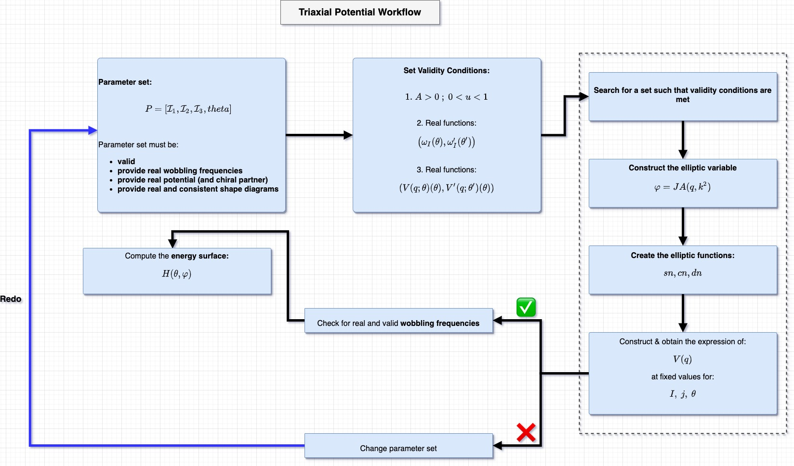
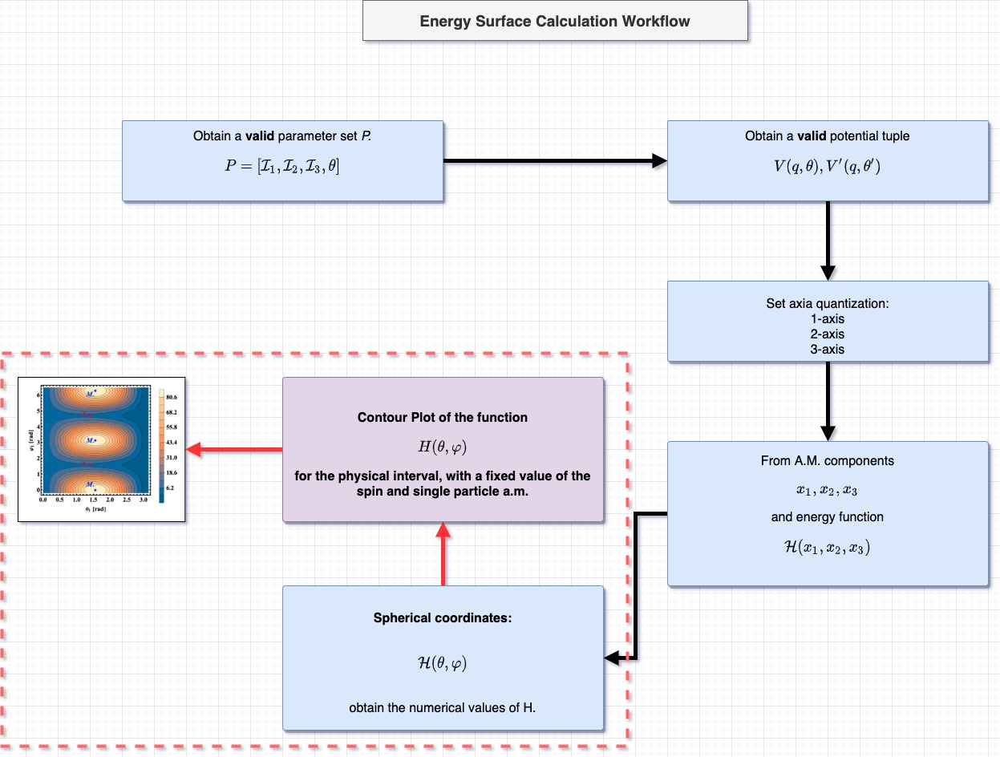

# Calculating the excitation energies for the wobbling spectra of $^{135}$Pr

Author: Robert Poenaru

E-mail: robert.poenaru@drd.unibuc.ro

- [Calculating the excitation energies for the wobbling spectra of $^{135}$Pr](#calculating-the-excitation-energies-for-the-wobbling-spectra-of-135pr)
  - [Least-squares-fit procedure for getting the $E_\text{RMS}$ and the free parameters](#least-squares-fit-procedure-for-getting-the-e_textrms-and-the-free-parameters)
  - [Details on the problem](#details-on-the-problem)
  - [Structure of the code](#structure-of-the-code)
    - [Time measurement](#time-measurement)
  - [Potential fit results](#potential-fit-results)
  - [Observation:](#observation)
  - [Potential fix for the chiral frequencies](#potential-fix-for-the-chiral-frequencies)
    - [New method for returning the wobbling frequency](#new-method-for-returning-the-wobbling-frequency)
  - [Partial results from the fast-mode data fit](#partial-results-from-the-fast-mode-data-fit)
  - [July 2020 Update - JPG submission](#july-2020-update---jpg-submission)
    - [Validity conditions](#validity-conditions)
    - [A detailed diagram with the overall workflow for finding valid parameters](#a-detailed-diagram-with-the-overall-workflow-for-finding-valid-parameters)
    - [A detailed diagram with the overall workflow for computing the energy function](#a-detailed-diagram-with-the-overall-workflow-for-computing-the-energy-function)

## Least-squares-fit procedure for getting the $E_\text{RMS}$ and the free parameters  

## Details on the problem

* The model has 5 free parameters: 
  * 3 inertia factors: $A_1,A_2,A_3$
  * the single particle potential strength $V$
  * the coupling angle $\theta$
* The experimental data set contains:
  * The yrast band Y0
  * The *one-phonon* wobbling band TW1
  * The (new) *two-phonon* wobbling band TW2. Experimentally confirmed in the recent work of Sensharma et al.[^1]

[^1]: Sensharma, N., et al. "Two-phonon wobbling in 135Pr." Physics Letters B 792 (2019): 170-174.

## Structure of the code

This `C++` project is structured as follows:

+ The **include** folder has the necessary header files for serving the experimental data 
  * `energyFormulas.h` - Calculating the energies for each band (numerical expressions) as a function of the input parameters 
  * `expData.h` - Serves the experimental data to the main algorithm. Experimental data consists in the energy states for the three triaxial bands (namely Y0,TW1 and TW2). Units are in MeV (if not, a transformation method will be provided in the header). **Algorithm works with EXCITATION energies**. So the first state from Y0 will be subtracted.
  * `fitProcedure.h` - The methods for calculating an RMS as a function of the free parameters and also a minimization procedure to find the best RMS value.
* The **cc** directory which includes:
  * `energyFormulas.cpp` 
  * `main.cpp` 
  * `fitProcedure.cpp`
 
 ### Time measurement

 The main `Fit` class has an instrument for measuring the time execution of any object which is instantiated by the user through a smart point (i.e. *unique pointer* or *shared pointer*)

  * `make_unique`
  * `make_shared`

The class `Fit` -> private variable to store the start point (when object is created via the default constructed).
The method `measureTime()` gives the total execution time of the class object on the main thread when it stops (through the default destructor).

## Potential fit results


These are the fit parameters obtained within the new `C++` algorithm which includes the confirmed two-phonon wobbling band `TW2`.

Searching for the best RMS finished...  
Total number of iterations= 793117000  
BEST RESULTS FOR THE THREE BANDS ARE:  
I1   I2   I3   THETA  
89   12   48   -71  
ENERGY RMS:   
0.174452  

## Observation:

It seems that for the obtained fit parameters, the wobbling frequencies calculated for a chiral transformation (i.e. rotated system with an angle $\pi$), the quantity under the square root in the expression of $\omega^I$ becomes negative, which results in a **complex value**
> **For these parameters, small spins might provide non-physical solutions!**

## Potential fix for the chiral frequencies

The wobbling frequency calculated by the current algorithm has only one value which depends on the coupling angle $\theta$.  
However, this wobbling frequency has a *chiral* partner, defined by the geometrical rotation with the angle $\pi$ around the quantization axis. So, having the normal mode wobbling frequency $\omega_\theta$ will result in the chiral partner 
$$\omega^\text{chiral}=\omega_{\theta+\pi}$$
In our results, the corresponding chiral partner of $\theta=-71^o$ would be $\theta^\text{chiral}=109^o$.
> Solution

Find the set of parameters **X** fot which the tuple $(\omega,\omega^\text{chiral})$ are real and positive numbers, so that the parameters will provide physical solutions to the problem;

### New method for returning the wobbling frequency

Define a tuple `omegaTuple` which returns a `struct` object `omegas`, that is of the type `omegas.omega` and `omegas.omegaChiral`

```
struct omegaTuple
{
  double omega;
  double omegaChiral;
};
//initialize the tuple for storing the two values of the frequencies.
auto omegas= new omegaTuple();
```

> introduce the object `omegas` in the fit condition so that both struct members are REAL and positive numbers

## Partial results from the fast-mode data fit

By doing a so called fast fit (where the steps for the free parameters are relatively large), an RMS which almost coincides with the previous one is obtained.  
With the obtained parameter set **X**, the chiral frequency is a real number, even for low spins.

Results can be seen below:  


```BEST RESULTS FOR THE THREE BANDS ARE:  
I1   I2   I3   THETA  
91   11   46   -54  
**ENERGY RMS:**
0.174611  
Process took 102.579 seconds  
```

## [July 2020 Update - JPG submission](workflow.md)

In this update, the program is replacing the wobbling frequency used in calculations with an alternative form: expanded around one of the local minima (from the original draft version).
If $\omega$ is the wobbling frequency corresponding the the triaxial potential, expanded around the global minimum ($q=0$), then $\omega'$ is the wobbling frequency of the rotor, in one of its local minimum points. The new fitting procedure adopts $\omega'$ in calculations, obtaining a new set of fitting parameters and a new value for the $E_{RMS}$.

### Validity conditions

The fit parameters must also be used in calculation of the triaxal potential itself (not only for the excitation energies). As a result, the parameter set (denoted from now with $P$) must also verify some special conditions that allow for the physical solutions of $V(q)$ to exist.

Moreover, after the calculation of the triaxial potential $V(q)$, some numerical computations must also be performed with regards to the energy surface $\mathcal{H}(\theta,\varphi)$. The energy surface $\mathcal{H}(\theta,\varphi)$ can be represented graphically through a *contour plot*. Using Wolfram Mathematica's built-in function `ContourPlot`, it is straightforward to plot this function once the fit parameters are determined.

**Obs:** However, besides the parameter set $P$, fixed values for the total spin of the nucleus and the value of the angular momentum for the odd-particle must also be assigned, as the energy surface depends on these two values explicitly.

>More info on the draft update's workflow can be seen [here](workflow.md)

```
Searching for the best RMS finished...
Total number of iterations= 196209000
BEST RESULTS FOR THE THREE BANDS ARE:
I1   I2   I3   THETA
91   9   51   -119
ENERGY RMS: 
0.174715
Process took 3728.41 seconds
```

### A detailed diagram with the overall workflow for finding valid parameters



### A detailed diagram with the overall workflow for computing the energy function

